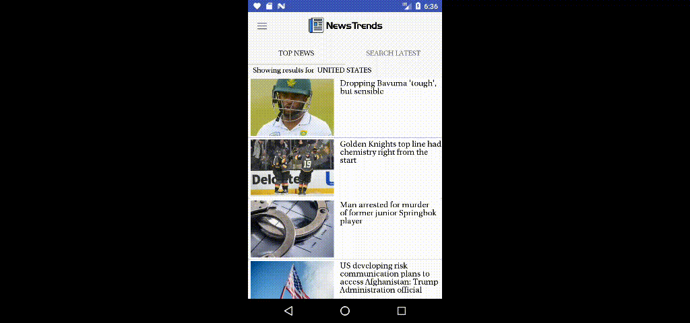

## About
NewsTrends is a News app developed to organize and customize the way user wants to read the the news. Most of the news apps suggest News around the world to the user which user can customize using categories, country and language in settings so that it will get to see the news from specified settings only.

Moreover, the user can save the news which he or she can read offline anywhere, anytime.

The app also features custom alerts for custom keywords for which FirebaseJobDispatcher works every 12 hours to see if any new News is there for the specified keyword. This news is available in the Alerts option in the app. If the users has previously deleted any news from alerts, favorites or currently present in the favorites, the news will not show up in the Alerts menu.

Top News are fetched every 3 hours or when the settings are changed. User cannot refresh Top News unless they change the settings.

## Libraries Used

The app uses following libraries
1) GeoIp - To detect Country at First Run
2) Retrofit / GSON - To make API calls and serialize/de-serialize JSON objects
3) FirebaseJobDispatcher - For regualr API calls
4) Glide - For Image Management
5) SwipeMenu - Swipe Menu for Alerts and Favorites screens
6) Firebase Crashalytics
7) Firebase Analytics

## ScreenFlow

## License
    Copyright 2017 Ravikiran Pathade

    Licensed under the Apache License, Version 2.0 (the "License");
    you may not use this file except in compliance with the License.
    You may obtain a copy of the License at

       http://www.apache.org/licenses/LICENSE-2.0

    Unless required by applicable law or agreed to in writing, software
    distributed under the License is distributed on an "AS IS" BASIS,
    WITHOUT WARRANTIES OR CONDITIONS OF ANY KIND, either express or implied.
    See the License for the specific language governing permissions and
    limitations under the License.
